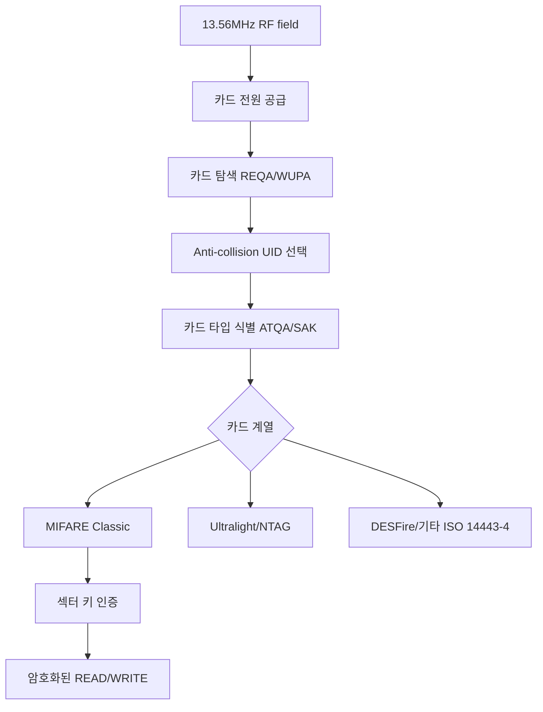

[목차](../index.md) | 이전: 없음 | 다음: [13.56MHz 물리 계층](02-physical-layer.md)

# 1. 서문: 13.56MHz 카드를 이해하기 위한 지도

13.56MHz 카드를 “NFC 카드”, “RFID 카드”, “MIFARE 카드”라고 섞어 부르는 일이 많다. 세 말은 서로 겹치지만 같은 뜻은 아니다.

RFID는 무선 식별 기술 전체를 가리키는 넓은 말이다. 125kHz 저주파 카드도 RFID이고, 13.56MHz 고주파 카드도 RFID다. NFC는 13.56MHz 대역에서 동작하는 근거리 통신 규격과 생태계를 말한다. MIFARE는 NXP의 13.56MHz 비접촉 카드 제품군 브랜드다. 따라서 어떤 카드가 13.56MHz라고 해서 반드시 MIFARE Classic은 아니며, MIFARE라고 해서 모두 같은 암호 방식을 쓰지도 않는다.

이 ebook의 중심 질문은 다음이다.

- 리더기에 카드를 가져다 대면 어떤 단계로 카드가 식별되는가?
- UID, ATQA, SAK 같은 값은 언제 오가는가?
- MIFARE Classic에서 Key A/Key B와 Crypto1은 어떤 역할을 하는가?
- 인증이 성공한 뒤 READ/WRITE 같은 명령은 어떻게 보호되는가?
- Flipper Zero로 무엇을 관찰할 수 있고, 무엇을 조심해야 하는가?

## 범위와 원칙

이 문서는 합법적인 분석과 학습을 전제로 한다. 본인 소유 카드, 테스트 카드, 직접 운영하는 리더기, 허가받은 실험 환경만 다룬다. 실제 출입증, 교통카드, 결제카드, 타인의 시스템을 대상으로 한 복제나 우회는 다루지 않는다.

## 큰 그림

13.56MHz 카드 통신은 대략 다음 순서로 이해하면 된다.

1. 리더가 RF field를 만들고 카드가 전력을 얻는다.
2. 리더가 주변 카드를 탐색한다.
3. 카드는 UID, ATQA, SAK 같은 식별 정보를 내놓는다.
4. 카드 종류에 따라 상위 프로토콜이나 전용 명령 집합으로 넘어간다.
5. MIFARE Classic은 섹터별 Key A/Key B로 인증한다.
6. 인증 후에는 Crypto1 keystream으로 명령과 응답이 암호화된다.

## 이 문서의 읽는 법

처음 읽을 때는 1장부터 8장까지 순서대로 읽는 편이 좋다. 이미 NFC 기본이 있다면 5장부터 MIFARE Classic 메모리 구조와 인증 흐름을 보면 된다. Flipper Zero 실습만 궁금하다면 11장과 12장을 먼저 읽되, 7장과 8장의 인증 개념을 함께 보는 것이 좋다.

[목차](../index.md) | 이전: 없음 | 다음: [13.56MHz 물리 계층](02-physical-layer.md)
