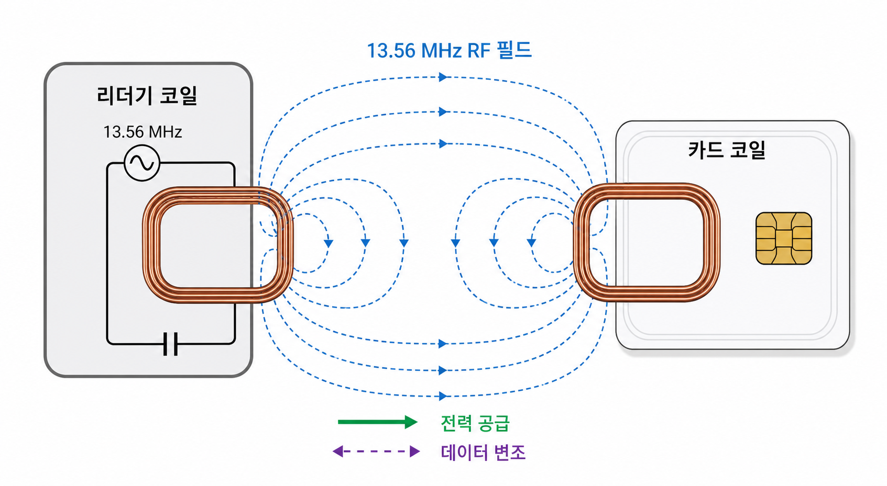

[목차](../index.md) | 이전: [서문: 13.56MHz 카드를 이해하기 위한 지도](01-introduction.md) | 다음: [NFC와 ISO/IEC 14443 Type A](03-iso14443a.md)

# 2. 13.56MHz 물리 계층

13.56MHz NFC 카드는 배터리가 없는 수동 카드인 경우가 많다. 카드는 리더가 만든 고주파 자기장 안에 들어가면서 전력을 얻고, 그 전력으로 내부 회로를 깨워 응답한다.

## 리더가 먼저 말한다

대부분의 상황에서 리더가 능동 장치다. 리더는 13.56MHz carrier를 만들고, 그 위에 명령을 실어 보낸다. 카드는 이 field 안에서 에너지를 얻고, 리더의 명령에 맞춰 응답한다.

## 카드는 어떻게 응답하는가

카드는 자체 송신기를 강하게 켜는 방식이 아니라, 안테나 부하를 바꾸는 방식으로 리더가 감지할 수 있는 변화를 만든다. 이를 load modulation이라고 부른다. 간단히 말하면, 카드는 리더가 만든 field를 살짝 흔들어 자신의 응답을 되돌려준다.

## 거리와 정렬

NFC가 “근거리”인 이유는 보안 때문만이 아니다. 물리적으로도 코일 결합이 거리와 방향에 민감하다. 카드와 리더 코일이 어긋나면 전력이 부족하거나 응답 신호가 약해질 수 있다. Flipper Zero로 읽을 때 카드 위치를 조금씩 움직여야 하는 경우가 생기는 이유도 여기에 있다.

## 여기서 암호화는 아직 아니다

물리 계층은 신호를 만들고 전달하는 기반이다. 암호화 여부는 이 위의 프로토콜과 카드 애플리케이션에서 결정된다. MIFARE Classic의 Crypto1은 RF field 자체를 암호화하는 것이 아니라, 인증 이후의 명령/응답 비트열에 keystream을 적용한다.

[목차](../index.md) | 이전: [서문: 13.56MHz 카드를 이해하기 위한 지도](01-introduction.md) | 다음: [NFC와 ISO/IEC 14443 Type A](03-iso14443a.md)
