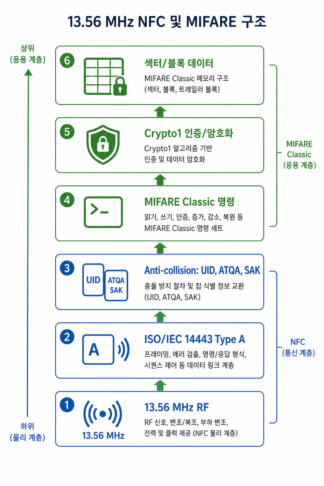
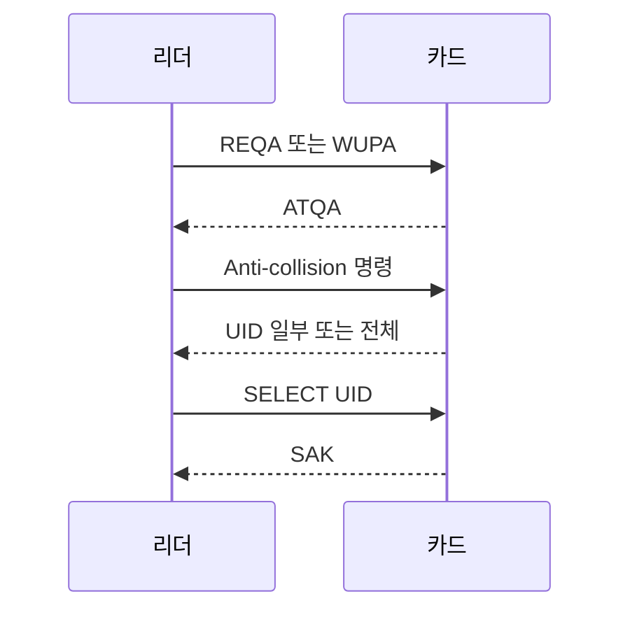

[목차](../index.md) | 이전: [13.56MHz 물리 계층](02-physical-layer.md) | 다음: [MIFARE 제품군 분류](04-mifare-families.md)

# 3. NFC와 ISO/IEC 14443 Type A

MIFARE Classic은 ISO/IEC 14443 Type A의 일부 절차를 기반으로 동작한다. 특히 카드 탐색, anti-collision, UID 선택 단계는 MIFARE Classic을 이해하는 출발점이다.

## 주요 값

`ATQA`는 카드가 Type A 탐색 요청에 응답할 때 제공하는 값이다. 카드의 UID 구조나 anti-collision 관련 힌트를 담는다.

`UID`는 카드 식별자다. 4바이트, 7바이트, 10바이트 UID가 있을 수 있다. UID는 카드 자체 식별에는 유용하지만, 이것만으로 사용자를 인증하는 시스템은 쉽게 취약해질 수 있다.

`SAK`는 선택된 카드가 어떤 성격의 카드인지 리더가 판단하는 데 쓰는 응답이다. 예를 들어 MIFARE Classic 계열인지, ISO 14443-4 상위 프로토콜로 넘어갈 수 있는지 등을 추정하는 단서가 된다.

## Anti-collision

리더 field 안에 카드가 여러 장 있을 수 있으므로, 리더는 한 장을 선택하는 절차를 수행한다. 이 과정이 anti-collision이다. 선택된 카드와 이후 통신이 이어진다.

## 중요한 구분

이 단계에서 보이는 UID, ATQA, SAK는 카드의 “문 앞” 정보에 가깝다. MIFARE Classic의 섹터 데이터는 별도 인증을 통과해야 읽을 수 있다. 따라서 Flipper Zero가 UID와 카드 타입은 보여주지만 모든 섹터 데이터를 읽지 못하는 상황은 정상적인 보안 동작일 수 있다.

[목차](../index.md) | 이전: [13.56MHz 물리 계층](02-physical-layer.md) | 다음: [MIFARE 제품군 분류](04-mifare-families.md)
