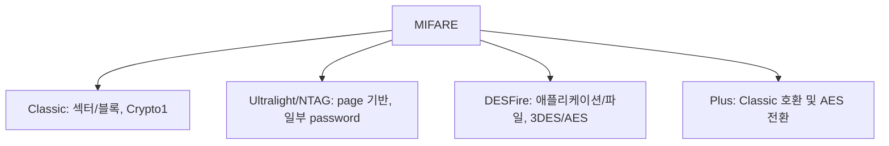

[목차](../index.md) | 이전: [NFC와 ISO/IEC 14443 Type A](03-iso14443a.md) | 다음: [MIFARE Classic 메모리 구조](05-classic-memory.md)

# 4. MIFARE 제품군 분류

MIFARE는 하나의 단일 포맷이 아니라 제품군이다. 카드가 MIFARE라고 해서 모두 같은 메모리 구조, 같은 키, 같은 암호 방식을 쓰는 것은 아니다.

## MIFARE Classic

MIFARE Classic은 오래된 메모리 카드 계열이다. 메모리가 섹터와 블록으로 나뉘고, 각 섹터는 Key A와 Key B, access bits로 보호된다. 암호 방식은 Crypto1이다. Crypto1은 현대 기준으로 안전하지 않다고 알려져 있으므로 신규 시스템에는 권장되지 않는다.

## MIFARE Ultralight와 NTAG

Ultralight와 NTAG는 주로 단순 태그, 티켓, URL 태그 등에 쓰인다. 메모리는 보통 page 단위로 구성된다. 제품에 따라 password 보호가 있을 수 있지만, Classic의 섹터 키 구조와는 다르다.

## MIFARE DESFire

DESFire는 애플리케이션과 파일 구조를 갖는 더 고급 카드다. 3DES 또는 AES 기반 보안을 사용하는 세대가 있으며, Classic과는 구조가 크게 다르다. Flipper Zero가 DESFire의 UID나 공개 파일 일부를 읽을 수 있어도, 보호된 애플리케이션 데이터는 키 없이는 읽을 수 없다.

## MIFARE Plus

MIFARE Plus는 Classic에서 더 강한 보안으로 이전하기 위한 계열이다. 보안 레벨에 따라 Classic 호환 모드와 AES 기반 모드가 존재할 수 있다.

## 실무에서의 첫 판단

카드를 분석할 때는 “13.56MHz인가?” 다음으로 “어떤 카드 계열인가?”를 봐야 한다. Classic인지 DESFire인지에 따라 관찰 가능한 값, 필요한 키, Flipper Zero의 동작, 보안 평가가 모두 달라진다.

[목차](../index.md) | 이전: [NFC와 ISO/IEC 14443 Type A](03-iso14443a.md) | 다음: [MIFARE Classic 메모리 구조](05-classic-memory.md)
