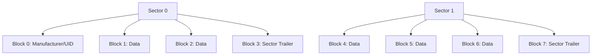

[목차](../index.md) | 이전: [MIFARE 제품군 분류](04-mifare-families.md) | 다음: [리더와 카드가 처음 만났을 때](06-discovery-anticollision.md)

# 5. MIFARE Classic 메모리 구조

MIFARE Classic을 이해하는 핵심은 섹터와 블록이다. 데이터는 균일한 한 덩어리가 아니라, 섹터별로 다른 키와 접근 조건을 가질 수 있다.

## Classic 1K

Classic 1K는 16개 섹터를 가진다. 각 섹터는 4개 블록으로 구성되고, 각 블록은 16바이트다. 섹터의 마지막 블록은 sector trailer이며, Key A, access bits, Key B가 저장된다.



## Sector Trailer

Sector Trailer는 해당 섹터의 보안 설정 블록이다.

```text
Byte 0..5    Key A
Byte 6..8    Access Bits
Byte 9       General Purpose Byte
Byte 10..15  Key B
```

Access Bits는 각 블록에 대해 어떤 키로 읽기, 쓰기, 증가, 감소가 가능한지 정한다. 이 값이 잘못 설정되면 섹터 접근이 의도치 않게 제한될 수 있다.

## Key A와 Key B

Key A와 Key B는 각각 6바이트, 즉 48비트 키다. 둘 중 하나 또는 둘 다를 인증에 사용할 수 있다. 어떤 키가 어떤 권한을 갖는지는 access bits가 정한다. 그래서 “키를 안다”는 것과 “원하는 명령을 실행할 수 있다”는 것은 같은 말이 아니다.

## Manufacturer Block

Sector 0의 Block 0은 제조 시 기록되는 영역이다. 일반 카드에서는 UID와 제조 정보가 들어가며, 보통 수정할 수 없다. 일부 “magic card”류는 이 영역을 바꿀 수 있지만, 그것은 일반 MIFARE Classic 카드의 정상 동작이 아니다.

[목차](../index.md) | 이전: [MIFARE 제품군 분류](04-mifare-families.md) | 다음: [리더와 카드가 처음 만났을 때](06-discovery-anticollision.md)
