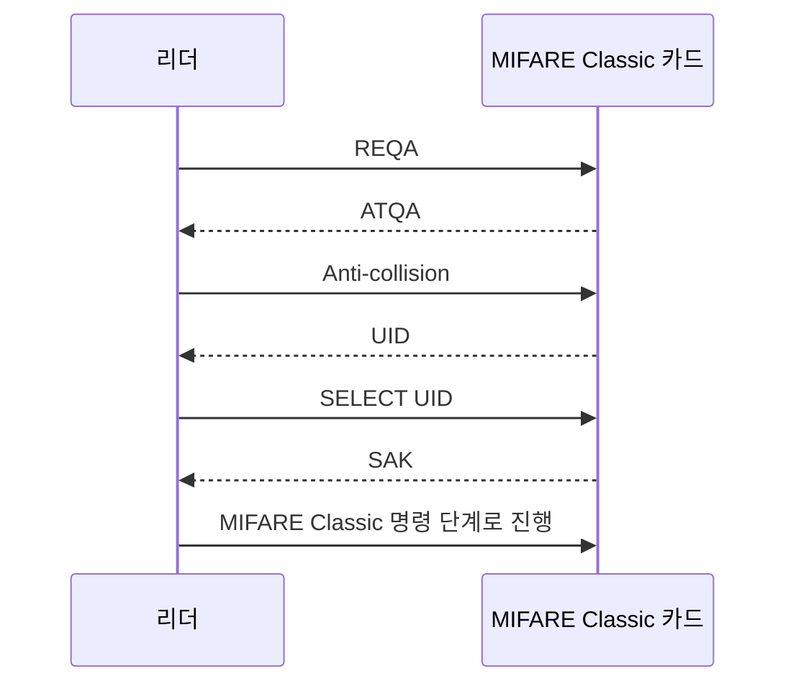

[목차](../index.md) | 이전: [MIFARE Classic 메모리 구조](05-classic-memory.md) | 다음: [MIFARE Classic 인증 흐름](07-classic-authentication.md)

# 6. 리더와 카드가 처음 만났을 때

카드를 리더에 가까이 대면 곧바로 섹터 데이터가 오가는 것이 아니다. 먼저 리더는 field 안의 카드를 깨우고, 어떤 카드와 대화할지 선택한다.

## 초기 교환

## 이때 리더가 알 수 있는 것

리더는 대체로 다음을 알 수 있다.

- 카드가 Type A field에 응답하는지
- UID가 무엇인지
- ATQA/SAK 조합상 어떤 계열로 보이는지
- 이후 Classic 명령을 시도할지, ISO 14443-4 상위 프로토콜을 시도할지

## 이때 알 수 없는 것

아직 특정 섹터의 실제 데이터는 모른다. Key A나 Key B를 사용한 인증이 필요하다. 리더가 UID만으로 문을 열거나 사용자를 식별한다면, 그것은 카드 내부의 보호된 데이터를 활용하지 않는 설계다.

## Flipper Zero에서 보이는 값

Flipper Zero가 알 수 없는 카드라도 UID, SAK, ATQA 정도를 표시하는 경우가 있다. 이 값들은 카드 탐색 단계에서 얻을 수 있기 때문이다. 반대로 섹터 데이터가 비어 보이거나 일부만 읽히는 것은 해당 섹터 키를 찾지 못했다는 의미일 수 있다.

[목차](../index.md) | 이전: [MIFARE Classic 메모리 구조](05-classic-memory.md) | 다음: [MIFARE Classic 인증 흐름](07-classic-authentication.md)
