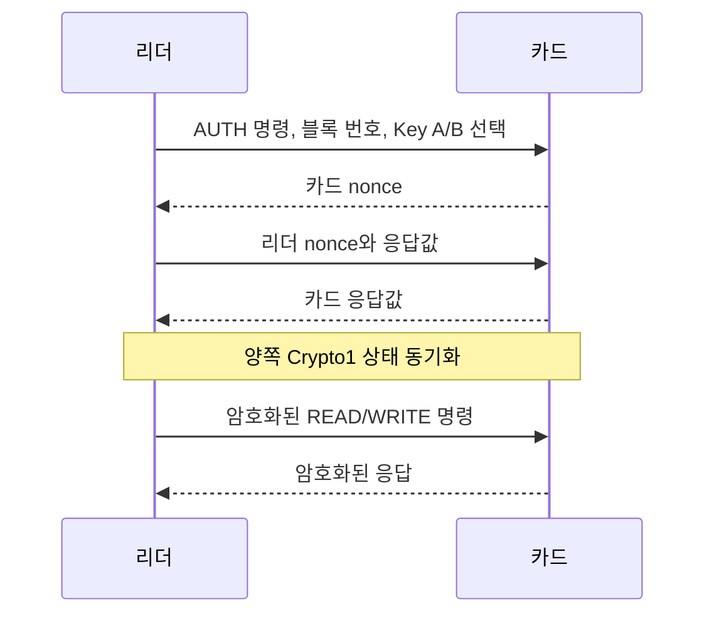

[목차](../index.md) | 이전: [리더와 카드가 처음 만났을 때](06-discovery-anticollision.md) | 다음: [Crypto1과 암호화 동작](08-crypto1.md)

# 7. MIFARE Classic 인증 흐름

MIFARE Classic에서 보호된 블록을 읽거나 쓰려면 먼저 해당 섹터에 대해 인증해야 한다. 인증은 Key A 또는 Key B 중 하나를 대상으로 한다.

## 인증 대상

리더는 “몇 번 블록에 대해 Key A로 인증하겠다” 또는 “Key B로 인증하겠다”는 식으로 인증을 시작한다. 실제 권한은 그 블록이 속한 섹터의 sector trailer에 의해 결정된다.

## 핵심 개념

키 자체는 무선으로 전송되지 않는다. 카드와 리더는 nonce와 암호 연산 결과를 교환하면서 서로 같은 키를 알고 있음을 증명한다. 인증이 성공하면 이후 통신은 Crypto1 keystream으로 보호된다.

## 성공 후 상태

인증은 카드 전체가 아니라 특정 섹터 접근을 위한 상태다. 한 섹터에 인증했다고 다른 섹터가 자동으로 열리지는 않는다. 리더가 여러 섹터를 읽어야 한다면 각 섹터에 대해 필요한 인증을 반복한다.

## 실패 시

키가 틀리거나 access bits가 허용하지 않는 동작을 시도하면 인증 또는 명령 처리가 실패한다. Flipper Zero로 읽을 때 “일부 섹터만 읽힘”은 흔한 결과다. 카드의 모든 데이터를 읽으려면 해당 섹터에 맞는 키들이 필요하다.

[목차](../index.md) | 이전: [리더와 카드가 처음 만났을 때](06-discovery-anticollision.md) | 다음: [Crypto1과 암호화 동작](08-crypto1.md)
