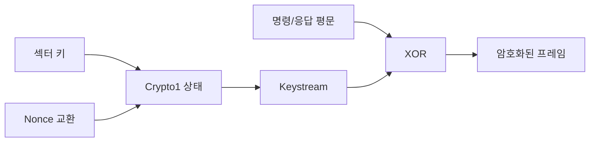

[목차](../index.md) | 이전: [MIFARE Classic 인증 흐름](07-classic-authentication.md) | 다음: [인증 후 명령 처리](09-post-auth-commands.md)

# 8. Crypto1과 암호화 동작

Crypto1은 MIFARE Classic에서 쓰이는 48비트 키 기반 stream cipher다. 현대적인 공개 검증 암호와 달리 오래된 독자 알고리즘이며, 이미 여러 연구에서 취약성이 알려져 있다.

## Stream cipher라는 의미

Stream cipher는 평문과 같은 길이의 keystream을 만들고, 평문과 keystream을 XOR해 암호문을 만든다. 복호화도 같은 keystream을 다시 XOR하는 방식이다.

## Nonce의 역할

인증 과정에서 카드와 리더는 nonce를 교환한다. nonce는 매번 달라져야 하는 임시값이며, 같은 키를 쓰더라도 매번 다른 인증 흐름이 되도록 돕는다. 그러나 MIFARE Classic의 난수 생성과 Crypto1 구조에는 알려진 약점이 있어, 특정 조건에서 키 복구 공격이 가능하다.

## 보호되는 것과 보호되지 않는 것

UID, ATQA, SAK 같은 초기 식별 정보는 인증 전에 보인다. 보호되는 것은 인증 후의 Classic 명령과 응답이다. 즉, “카드의 존재와 기본 식별자”는 보일 수 있지만, “섹터 내부 데이터”는 인증에 의해 보호된다.

## 취약성의 의미

Crypto1이 취약하다는 것은 모든 시스템이 자동으로 같은 위험이라는 뜻은 아니다. 위험은 카드 종류, 키 관리, 리더 동작, 백엔드 검증, UID 의존 여부에 따라 달라진다. 다만 신규 시스템을 설계한다면 MIFARE Classic에 의존하지 않는 것이 맞다.

[목차](../index.md) | 이전: [MIFARE Classic 인증 흐름](07-classic-authentication.md) | 다음: [인증 후 명령 처리](09-post-auth-commands.md)
