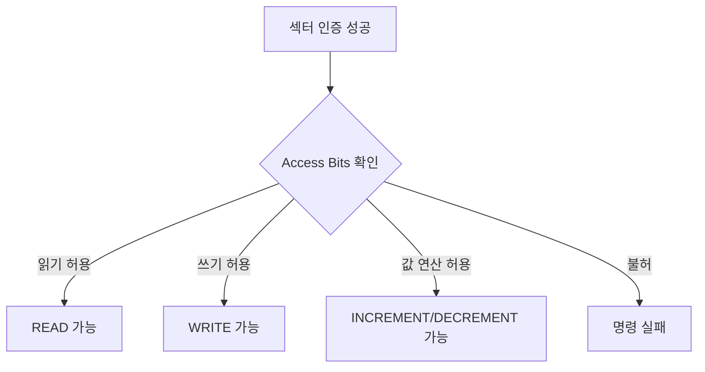

[목차](../index.md) | 이전: [Crypto1과 암호화 동작](08-crypto1.md) | 다음: [리더기에서 실제로 처리되는 값들](10-reader-processing.md)

# 9. 인증 후 명령 처리

MIFARE Classic에서 인증이 성공하면 리더는 해당 섹터의 블록에 명령을 보낼 수 있다. 다만 가능한 동작은 access bits와 사용한 키에 의해 제한된다.

## 대표 명령

`READ`는 16바이트 블록을 읽는다. 리더가 특정 블록을 요청하면 카드가 해당 블록 데이터를 응답한다.

`WRITE`는 16바이트 블록을 쓴다. 권한이 없으면 실패한다.

`INCREMENT`, `DECREMENT`, `TRANSFER`, `RESTORE`는 value block에서 금액이나 카운터처럼 쓰이는 값을 다루기 위한 명령이다.

## 권한의 위치

권한은 애플리케이션 코드가 아니라 카드의 sector trailer에 들어 있다. 어떤 키로 어떤 블록을 읽거나 쓸 수 있는지는 access bits가 정한다.

## 암호화된 프레임의 관점

인증 후 리더와 카드는 Crypto1 상태를 공유한다. 이후 명령과 응답은 keystream으로 보호된다. 외부에서 RF 통신을 관찰해도 평문 명령과 데이터가 그대로 보이는 구조는 아니다. 그러나 Crypto1 자체가 취약하므로, “암호화되어 있다”와 “현대적으로 안전하다”는 별개의 평가다.

[목차](../index.md) | 이전: [Crypto1과 암호화 동작](08-crypto1.md) | 다음: [리더기에서 실제로 처리되는 값들](10-reader-processing.md)
