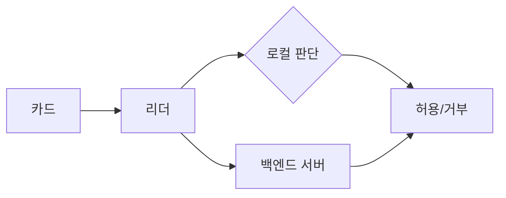

[목차](../index.md) | 이전: [인증 후 명령 처리](09-post-auth-commands.md) | 다음: [Flipper Zero로 관찰하기](11-flipper-observation.md)

# 10. 리더기에서 실제로 처리되는 값들

카드와 리더 사이에 오가는 값이 모두 같은 중요도를 갖는 것은 아니다. 실제 시스템은 설계에 따라 UID만 볼 수도 있고, 특정 섹터의 데이터를 읽을 수도 있고, 백엔드 서버와 함께 검증할 수도 있다.

## UID만 보는 시스템

가장 단순한 리더는 UID만 읽고 출입 허용 여부를 결정한다. 구현은 쉽지만 보안성은 낮다. UID는 인증 전에 노출되며, 일부 카드나 에뮬레이터에서는 UID 재현이 가능할 수 있다.

## 섹터 데이터를 읽는 시스템

조금 더 복잡한 시스템은 특정 섹터에 인증한 뒤 블록 데이터를 읽는다. 예를 들어 사용자 번호, 권한 코드, 잔액, 카운터 등을 카드에 저장할 수 있다. 이 경우 섹터 키와 access bits 관리가 중요하다.

## 백엔드와 연동되는 시스템

더 안전한 설계는 카드 내부 값만 믿지 않고 서버 상태와 함께 검증한다. 예를 들어 카드에는 식별자나 서명된 토큰만 두고, 실제 권한은 서버에서 판단할 수 있다.

## 같은 카드, 다른 위험

같은 MIFARE Classic 카드라도 시스템 설계에 따라 위험이 다르다. UID만 쓰는 시스템은 카드 내부 암호화와 무관하게 약할 수 있다. 반대로 Classic을 쓰더라도 서버 검증과 이상 탐지가 있으면 단순 복제 시도가 실패할 수 있다. 다만 Classic의 Crypto1 취약성 때문에 장기적으로는 더 강한 카드로 이전하는 것이 바람직하다.

[목차](../index.md) | 이전: [인증 후 명령 처리](09-post-auth-commands.md) | 다음: [Flipper Zero로 관찰하기](11-flipper-observation.md)
