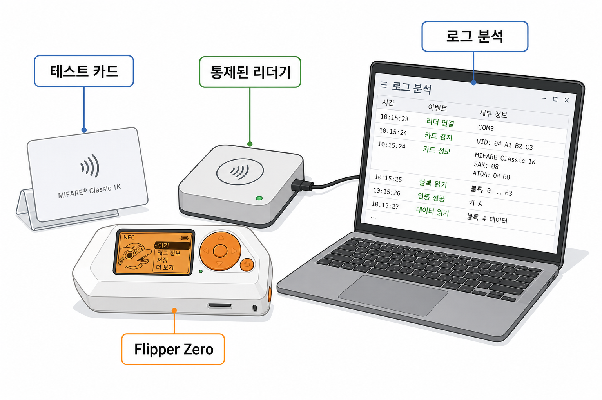

[목차](../index.md) | 이전: [리더기에서 실제로 처리되는 값들](10-reader-processing.md) | 다음: [Flipper Zero 실습 설계](12-flipper-labs.md)

# 11. Flipper Zero로 관찰하기

Flipper Zero는 13.56MHz NFC 모듈을 통해 여러 NFC 카드를 읽고 저장하고, 카드 타입에 따라 에뮬레이션할 수 있다. 공식 문서 기준으로 MIFARE Classic 1K, 4K, Mini 읽기를 지원하며, 섹터 데이터를 읽으려면 각 섹터의 키가 필요하다.

## 읽기에서 보이는 정보

NFC 읽기 기능으로 다음과 같은 정보를 볼 수 있다.

- UID
- ATQA
- SAK
- 카드 계열 추정
- 읽을 수 있는 메모리 데이터
- MIFARE Classic의 경우 발견한 섹터 키와 읽힌 섹터 범위

## Dictionary 기반 키 시도

MIFARE Classic 카드의 섹터를 읽으려면 Key A 또는 Key B가 필요하다. Flipper Zero는 system dictionary와 user dictionary의 키를 사용해 섹터를 읽으려 시도한다. 사용자가 합법적으로 알고 있는 테스트 카드 키는 user dictionary에 추가할 수 있다.

## 저장, 에뮬레이션, 동기화

카드를 저장하면 Flipper Zero 내부에 읽은 상태가 남는다. 이후 데이터를 수정하면 실제 물리 카드와 Flipper에 저장된 상태가 어긋날 수 있다. 공식 문서에서는 초기 카드에 쓰기, 초기 카드에서 업데이트, 원본 복원 같은 흐름을 설명한다. 이 차이를 이해하지 못하면 “Flipper에 보이는 데이터”와 “실제 카드 데이터”를 혼동하기 쉽다.

## 제한

Flipper Zero가 보여주는 결과는 카드 종류와 키 보유 여부에 좌우된다. DESFire처럼 보호된 애플리케이션 구조를 가진 카드는 UID나 공개 데이터만 보일 수 있다. Classic도 키를 모르면 일부 섹터만 읽히거나 UID/SAK/ATQA 정도만 확인될 수 있다.

[목차](../index.md) | 이전: [리더기에서 실제로 처리되는 값들](10-reader-processing.md) | 다음: [Flipper Zero 실습 설계](12-flipper-labs.md)
