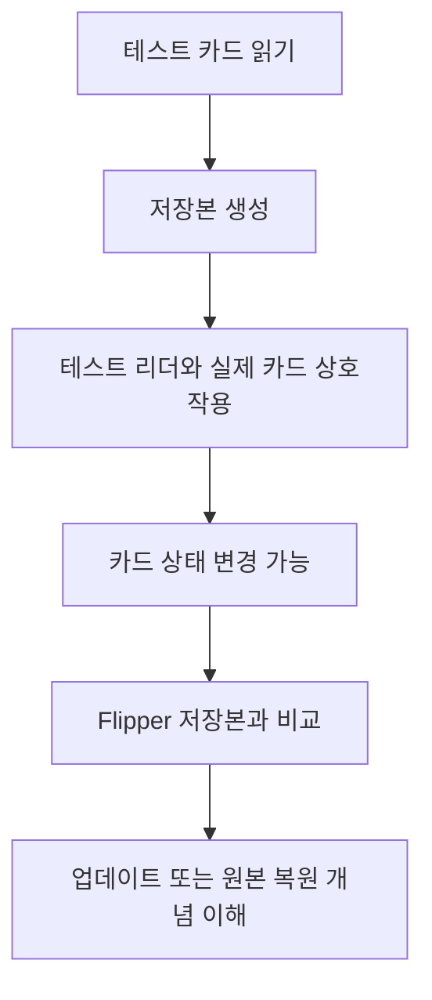

[목차](../index.md) | 이전: [Flipper Zero로 관찰하기](11-flipper-observation.md) | 다음: [MFKey32와 Nested 계열 공격의 개념](13-key-recovery-concepts.md)

# 12. Flipper Zero 실습 설계

실습은 반드시 본인 소유의 테스트 카드와 직접 제어 가능한 리더에서 진행한다. 출입증, 교통카드, 결제카드, 회사나 학교의 운영 시스템은 실습 대상이 아니다.

## 준비물

- Flipper Zero
- 테스트용 MIFARE Classic 1K 카드
- 본인이 소유한 NFC 리더 또는 개발 보드
- 카드 키를 알고 있는 테스트 환경
- 로그를 볼 수 있는 PC

## 실습 1: 카드 타입 식별

목표는 카드가 어떤 계열인지 확인하는 것이다. Flipper Zero의 NFC 읽기 기능으로 UID, ATQA, SAK, 카드 타입 표시를 기록한다. 이 단계에서는 보호된 데이터가 읽히지 않아도 정상이다.

## 실습 2: 기본 키와 사용자 키 비교

테스트 카드에 기본 키 또는 직접 설정한 키를 넣고, Flipper Zero dictionary에 키가 있을 때와 없을 때 읽히는 섹터 수를 비교한다. 관찰 포인트는 “키 보유 여부가 섹터 데이터 접근에 어떤 차이를 만드는가”다.

## 실습 3: 섹터별 권한 확인

테스트 카드의 한 섹터에서 Key A와 Key B의 권한을 다르게 설정한다. 같은 섹터라도 어떤 키로 인증했는지에 따라 READ/WRITE 가능 여부가 달라지는지 확인한다.

## 실습 4: 리더와 카드의 상태 차이

Flipper Zero에 저장된 카드 데이터와 실제 카드 데이터를 비교한다. 실제 카드가 리더와 상호작용한 뒤 값이 바뀌는 시스템이라면, 저장본이 오래된 상태가 될 수 있다. 이 실습은 “복사본”과 “현재 상태”가 다를 수 있음을 이해하기 위한 것이다.



## 기록 양식

```text
날짜:
카드 타입:
UID:
ATQA:
SAK:
읽힌 섹터 수:
사용한 키:
관찰한 차이:
```

[목차](../index.md) | 이전: [Flipper Zero로 관찰하기](11-flipper-observation.md) | 다음: [MFKey32와 Nested 계열 공격의 개념](13-key-recovery-concepts.md)
