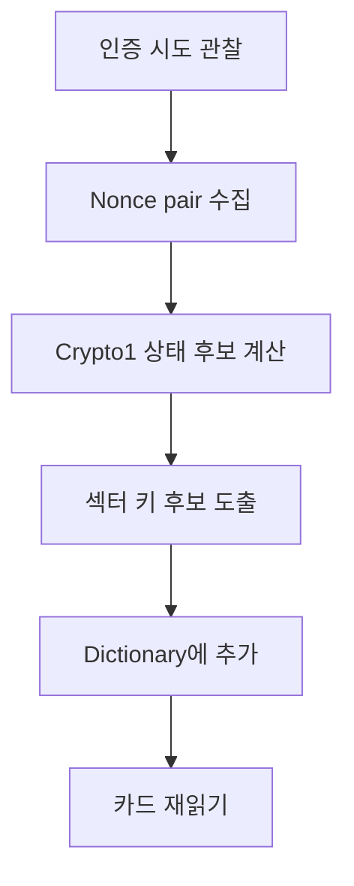

[목차](../index.md) | 이전: [Flipper Zero 실습 설계](12-flipper-labs.md) | 다음: [보안 관점 정리](14-security-guidance.md)

# 13. MFKey32와 Nested 계열 공격의 개념

MIFARE Classic은 Crypto1과 난수 생성 방식의 약점 때문에 키 복구 연구가 오래전부터 공개되어 있다. Flipper Zero 공식 문서도 MFKey32, nested, static nested, hardnested 계열 흐름을 설명한다. 이 장은 공격 실행 매뉴얼이 아니라 원리와 방어 관점의 요약이다.

## MFKey32의 아이디어

MFKey32는 리더와 카드의 인증 과정에서 나온 nonce 관련 정보를 이용해 Crypto1 내부 상태와 키를 추정하는 접근이다. 핵심은 키가 직접 전송되지 않아도, 취약한 인증 transcript에서 키에 관한 정보를 되살릴 수 있다는 점이다.

## Nested 계열의 아이디어

일부 섹터 키를 이미 알고 있으면, 그 인증 상태를 발판으로 다른 섹터 키를 추정하는 공격이 가능하다. 이것이 nested 계열 공격의 큰 그림이다. 카드와 리더의 난수 품질, 카드 세대, 이미 알고 있는 키의 유무에 따라 가능한 방식이 달라진다.

## Flipper Zero에서의 의미

Flipper Zero는 Classic 카드를 읽는 과정에서 필요한 키를 dictionary로 시도하고, 부족한 경우 nonce 수집이나 키 계산 흐름을 제공할 수 있다. 공식 문서는 물리 카드와 리더가 있는 경우, 리더만 있는 경우, 카드만 있는 경우의 차이를 설명한다.

## 방어 관점

이 공격군의 존재는 MIFARE Classic을 신규 보안 시스템에 쓰면 안 된다는 강한 신호다. 방어는 “키를 더 복잡하게 한다”만으로 충분하지 않다. Classic 자체의 구조적 한계 때문에 DESFire, Plus의 AES 보안 레벨, 또는 다른 현대적 인증 체계로 이전하는 것이 맞다.

[목차](../index.md) | 이전: [Flipper Zero 실습 설계](12-flipper-labs.md) | 다음: [보안 관점 정리](14-security-guidance.md)
