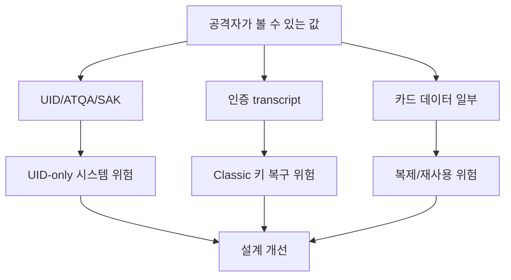

[목차](../index.md) | 이전: [MFKey32와 Nested 계열 공격의 개념](13-key-recovery-concepts.md) | 다음: [부록: 용어와 참고자료](15-appendix.md)

# 14. 보안 관점 정리

MIFARE Classic은 이해하기 좋은 학습 대상이지만, 신규 보안 시스템의 기반으로는 적합하지 않다. 특히 출입, 결제, 권한 관리처럼 실패 비용이 큰 시스템에서는 더 강한 카드와 더 나은 시스템 설계가 필요하다.

## 피해야 할 설계

- UID만으로 사용자를 인증한다.
- 모든 카드와 모든 섹터에 같은 키를 쓴다.
- 기본 키를 그대로 둔다.
- 카드 내부 값만 믿고 서버 검증을 하지 않는다.
- 키 교체, 폐기, 분실 대응 절차가 없다.

## 나은 설계 방향

- DESFire 또는 AES 기반 보안 레벨을 검토한다.
- 카드별, 애플리케이션별 키 분리를 적용한다.
- 백엔드에서 권한과 상태를 검증한다.
- 리더 로그와 이상 탐지를 둔다.
- 테스트 카드와 운영 카드를 명확히 분리한다.

## 위험 모델

## Flipper Zero를 보는 관점

Flipper Zero는 문제의 원인이 아니라 관찰 도구다. 취약한 시스템은 Flipper Zero가 없어도 취약하다. 중요한 것은 도구를 금지하는 것이 아니라, UID-only 설계와 Classic 의존을 줄이고, 카드와 리더와 서버의 신뢰 경계를 올바르게 설계하는 것이다.

[목차](../index.md) | 이전: [MFKey32와 Nested 계열 공격의 개념](13-key-recovery-concepts.md) | 다음: [부록: 용어와 참고자료](15-appendix.md)
